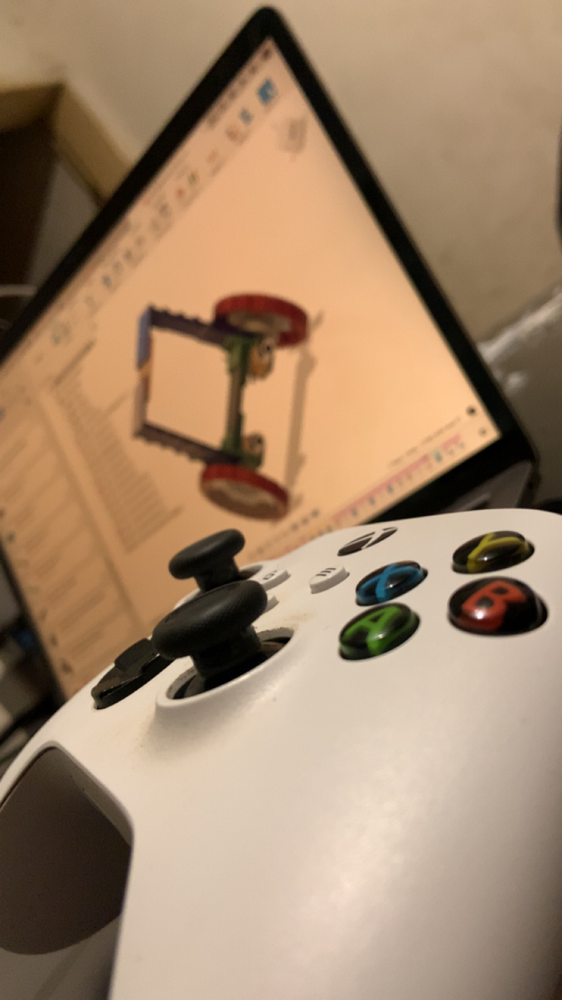
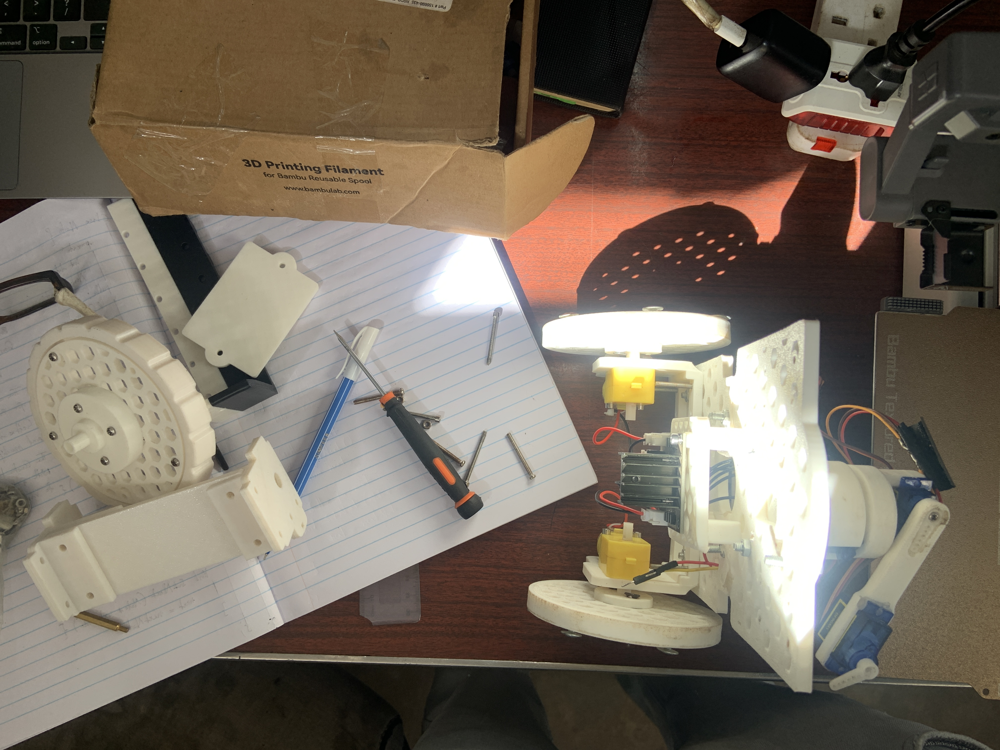
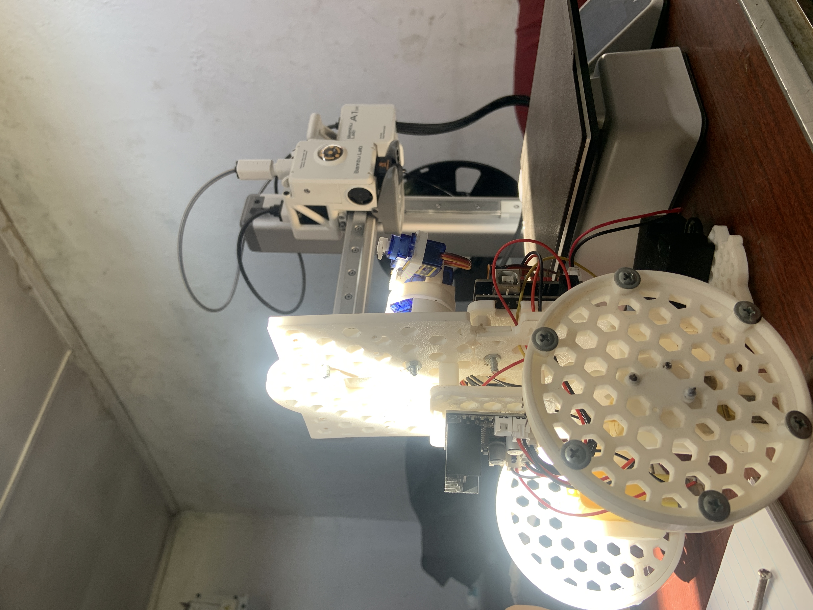
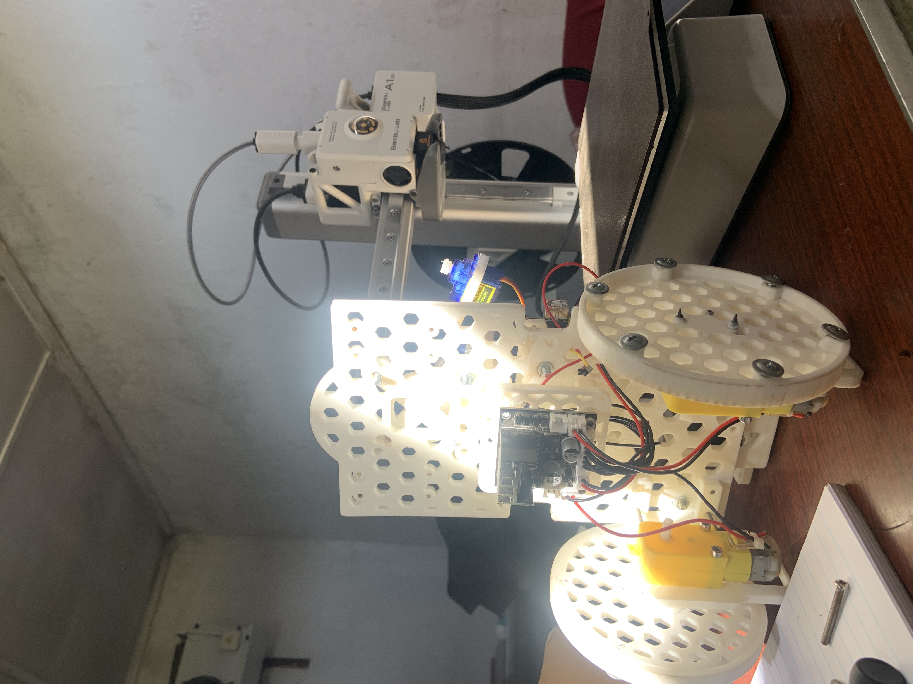
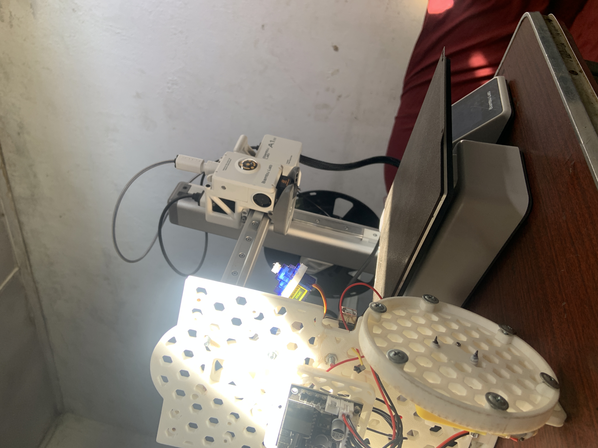
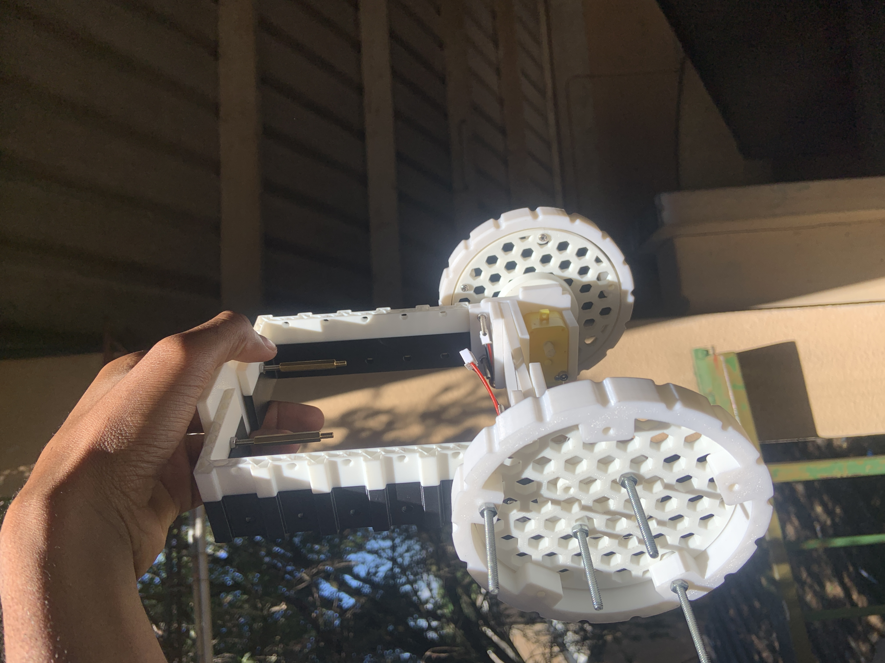
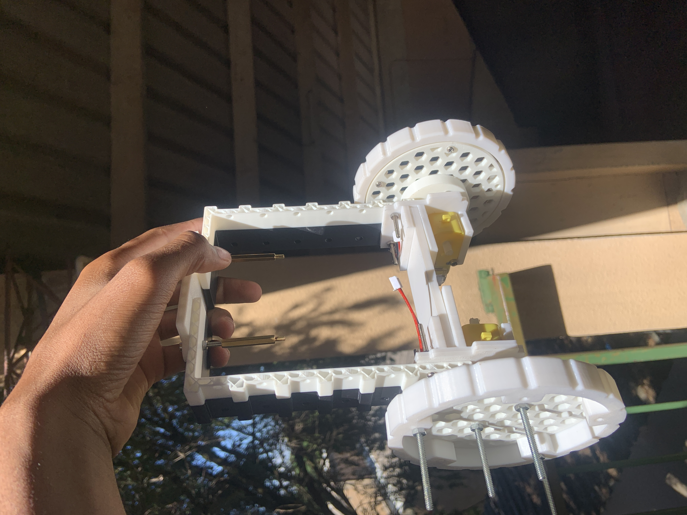
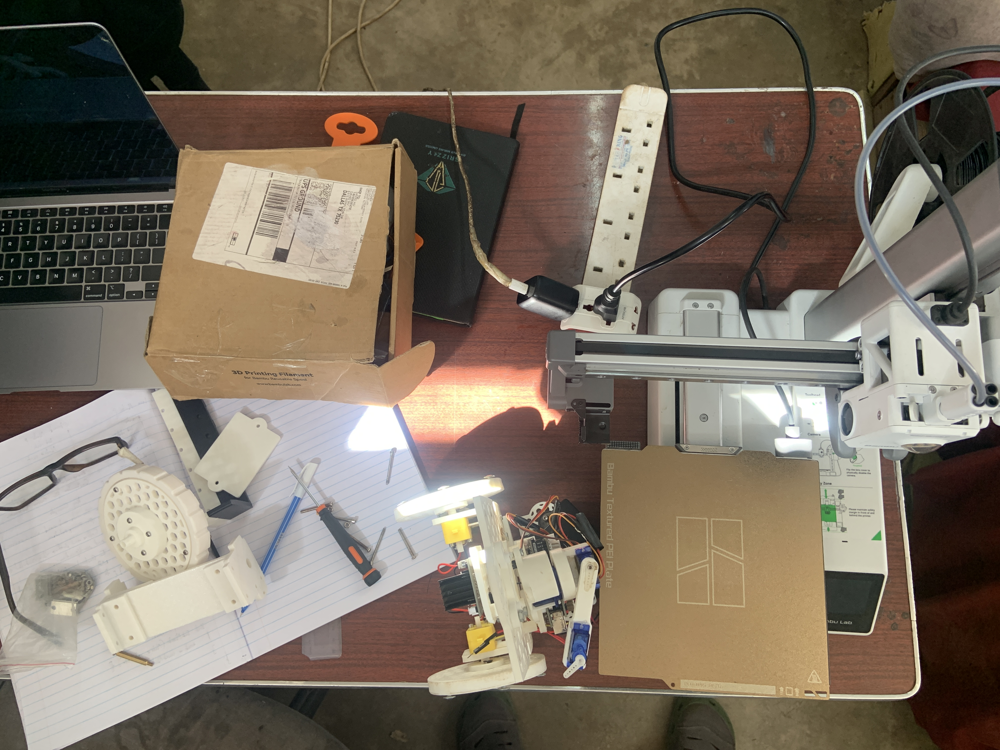
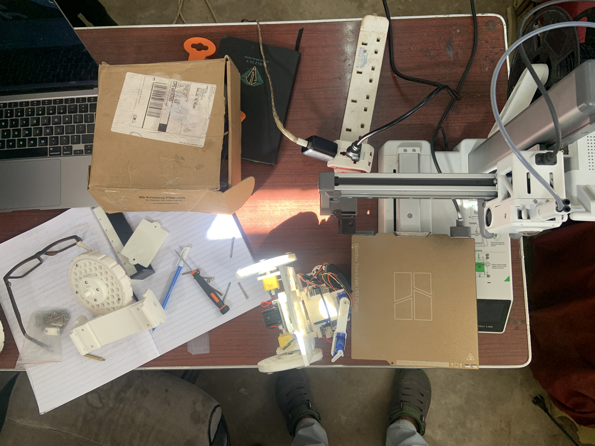

# Building an Affordable Self-Balancing Robot for African Education 🤖

	
	
	
	

	

## The Vision 🎯

I've been working on creating a self-balancing robotics platform specifically designed for education here in Zambia and across Africa. The goal is ambitious but necessary: build a custom PCB-based robot that costs under $80 instead of the $120-$700 that imported robotics kits typically run (excluding shipping and taxes that make them even more unaffordable).

	
	 <em>Early prototype of the self-balancing robot</em>

The platform would include:
- 🧠 ESP32 microcontroller for processing and wireless communication
- 📡 IMU sensors for balance control
- 🔌 Dual motor drivers
- 🧩 Custom PCB design
- 🧱 3D printed chassis components
- 🏭 Local manufacturing to keep costs down

---

## Table of Contents 🗂️

- [The Vision](#the-vision-)
- [Why This Matters](#why-this-matters-)
- [Showcase Gallery](#showcase-gallery-)
- [The Reality Check](#the-reality-check-)
- [My Learning Curve](#my-learning-curve-)
- [How You Can Help](#how-you-can-help-)
- [The Bigger Picture](#the-bigger-picture-)
- [Next Steps](#next-steps-)
- [Get Involved](#get-involved-)
- [Final Thoughts](#final-thoughts-)

## Why This Matters 🌍

Since 2022, I've had the incredible privilege of impacting over 8000+ young people across Zambia through various programs covering digital literacy, robotics, and Artificial Intelligence. Every time I run these sessions, I see the same thing: brilliant, curious minds hungry to learn and create, but limited by access to affordable tools and platforms.

Most robotics kits are either impossible to import affordably to our markets or simply don't exist here. When they do make it through, the costs are prohibitive for most students, schools, and even makerspaces. This project aims to change that by creating something locally relevant, affordable, and designed specifically for our context.

## Showcase Gallery 📸

	
	
	

	
More photos

	

		
		
		
	

---

## The Reality Check 🧪

Here's where I get honest about my learning journey (and current challenges):

**What's Working ✅:**

The prototype actually works! I managed to get a functional self-balancing robot using mostly recycled components from other projects, so I didn't blow through money I didn't have. The basic concept is sound, and seeing it balance (even briefly) was incredibly encouraging.

	
	 <em>Robot balancing in action</em>

**What's Not Working ⚠️:**
- The DC gear motors I used are too small to properly support the robot's weight, so it struggles under load
- My MPU sensor gives inconsistent readings - though I suspect this is more about me needing to spend quality time learning how to tune it properly rather than the sensor being fundamentally flawed
- The mechanical design has some stability issues that need addressing

**What's Still in Development 🛠️:**
- The custom PCB is still just an idea in my head rather than an actual design layout
- I need to optimize the 3D printed components for better structural integrity
- The control algorithms need refinement

	
	 <em>PCB and mechanical design concepts</em>

## My Learning Curve 📈

I should be upfront: I'm no expert in any of these technical branches. 3D modeling, PCB design, control systems, embedded programming - this project and others I've worked on have all been massive learning experiences. Every "failure" has taught me something valuable, but I've definitely hit the point where I could use guidance from people who've walked this path before.

This isn't about admitting defeat - it's about recognizing that complex projects benefit from community knowledge and collaboration. Some of my best learning has come from bouncing ideas off people who see things I miss or approach problems differently.

## How You Can Help 🤝

I'm looking for any kind of support, and it doesn't have to be a huge commitment:

**Technical Guidance 🛠️:**
- Experience with self-balancing robots or control systems
- PCB design feedback and best practices
- 3D modeling optimization tips
- Component selection advice
- Code review for balancing algorithms

**Knowledge Sharing 📚:**
- Pointing me toward useful resources, tutorials, or documentation
- Sharing your own project experiences and lessons learned
- Connecting me with others who might be interested in collaborating

**Brainstorming 🧠:**
- Manufacturing and scaling strategies
- Educational curriculum integration ideas
- Distribution and partnership opportunities

**Community Building 🌱:**
- Spreading the word about the project
- Connecting me with educational institutions or maker communities
- Sharing this with anyone who might be interested in African tech innovation

## The Bigger Picture 🌐

This isn't just about building one robot - it's about creating a foundation for robotics education that can scale across the continent. The plan includes:

- Open-source designs that others can build upon
- Educational resources and curriculum materials
- Partnerships with schools and maker spaces
- A pathway for local manufacturing and job creation
- Documentation that helps others start similar projects in their communities

Every learning moment, every component test, every design iteration gets us closer to something that can genuinely impact how young people across Africa engage with technology and innovation.

## Next Steps 🚀

I'm currently working on:
- [ ] Upgrading the motor specifications to handle the robot's weight properly
- [ ] Deep-diving into MPU sensor calibration and tuning
- [ ] Moving from concept to actual PCB design layout
- [ ] Optimizing the mechanical design for better stability
- [ ] Building partnerships with local manufacturers

## Get Involved 📣

If any of this resonates with you - whether you're a technical expert, educator, maker, or just someone who believes in making technology more accessible - I'd love to connect.

You can reach me through:
- This platform (just send a message!)
- Website: [www.plastalbotbuilders.com](https://plastalbot.comon.tech/home)
- Email: fredrickmwepu22@gmail.com

Even if you can't directly contribute technical expertise, sharing this project, connecting me with others, or just offering encouragement makes a real difference.

## Final Thoughts 💡

Building this robot has been humbling, educational, and incredibly motivating. Every challenge reminds me why this work matters - because somewhere, a young person is waiting for the chance to build something amazing, and we have the opportunity to make that possible.

	
	 <em>Click image to watch a short demo video</em>

Note: Some browsers may not preview .MOV inline on GitHub. If playback doesn't start, use “Download” or open in a new tab.

Thanks for taking the time to read this, and thanks in advance for any way you choose to support this journey. Together, we can turn this wobbly prototype into something that empowers the next generation of African innovators.

---

*This project represents just one piece of the larger puzzle of making technology education accessible across Africa. Every contribution, no matter how small, helps build that future.*
