# Robo Core Zambia

	
	
	
	

	

## The Vision 🎯

I've been working on creating **RoboCore Zambia** — a locally engineered, modular robotics and embedded systems development platform designed for STEM education across Zambia and Africa. The goal is ambitious but necessary: build an affordable, open-source platform that enables educators and makers to teach robotics, IoT, and embedded systems design without relying on expensive imported kits (which typically cost $120–$700 or more, before shipping and customs).

RoboCore Zambia isn't a single application — it's a flexible foundation. Self-balancing robots, autonomous vehicles, drone controllers, IoT sensors, and wireless communication projects are all possible with the same core platform.

	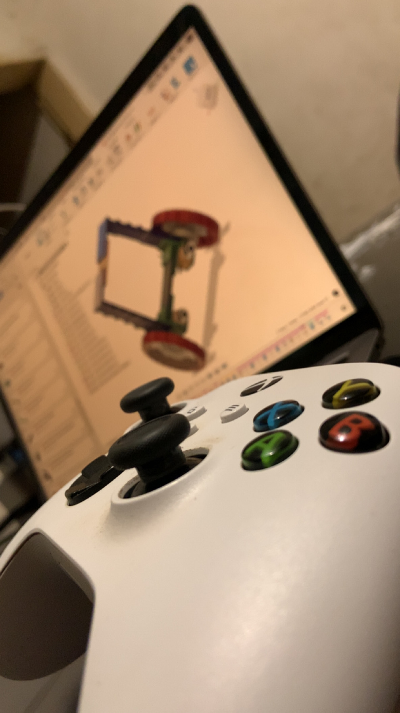
	 <em>Early prototype demonstrating the RoboCore Zambia platform</em>

The platform includes:
- 🧠 ESP32 microcontroller for processing and wireless communication
- 📡 IMU sensors (MPU-6050) for motion sensing and orientation tracking
- 🔌 Dual H-bridge motor drivers with high-current capability
- 🧩 Custom 2-layer PCB for integrated control and reliability
- 🧱 Modular connectors for motors, sensors, and expansions
- 🏭 Open-source design files for local manufacturing and customization

---

## Table of Contents 🗂️

- [The Vision](#the-vision-)
- [Why This Matters](#why-this-matters-)
- [Showcase Gallery](#showcase-gallery-)
- [The Reality Check](#the-reality-check-)
- [My Learning Curve](#my-learning-curve-)
- [How You Can Help](#how-you-can-help-)
- [The Bigger Picture](#the-bigger-picture-)
- [Next Steps](#next-steps-)
- [Get Involved](#get-involved-)
- [Final Thoughts](#final-thoughts-)

## Why This Matters 🌍

Since 2022, I've had the incredible privilege of impacting over 8000+ young people across Zambia through various programs covering digital literacy, robotics, and Artificial Intelligence. Every time I run these sessions, I see the same thing: brilliant, curious minds hungry to learn and create, but limited by access to affordable tools and platforms.

Most robotics kits are either impossible to import affordably to our markets or simply don't exist here. When they do make it through, the costs are prohibitive for most students, schools, and even makerspaces. This project aims to change that by creating something locally relevant, affordable, and designed specifically for our context.

## Showcase Gallery 📸

	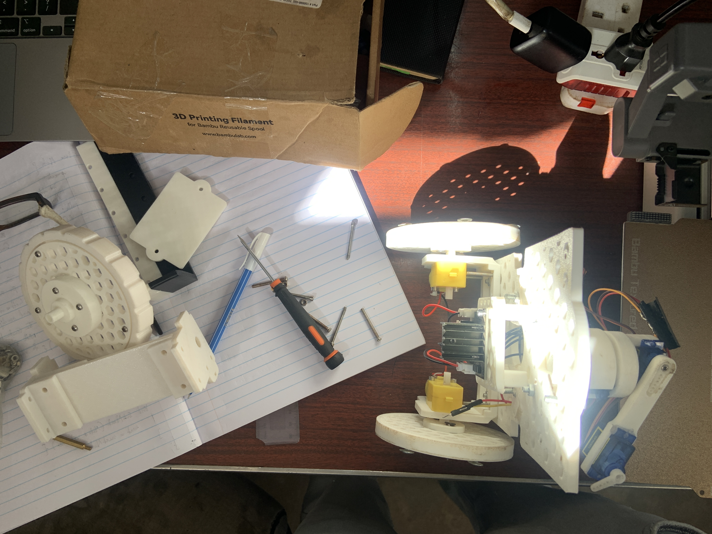
	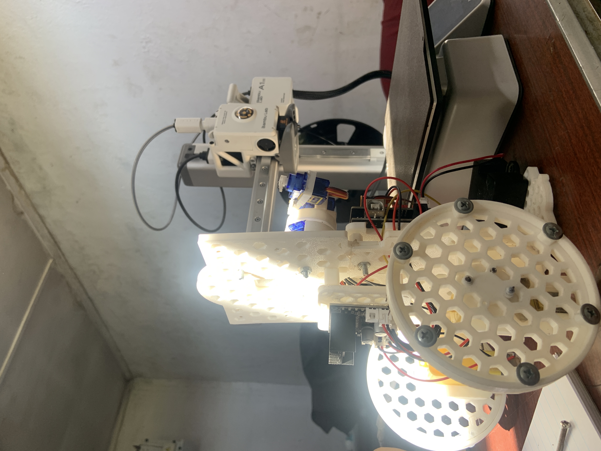
	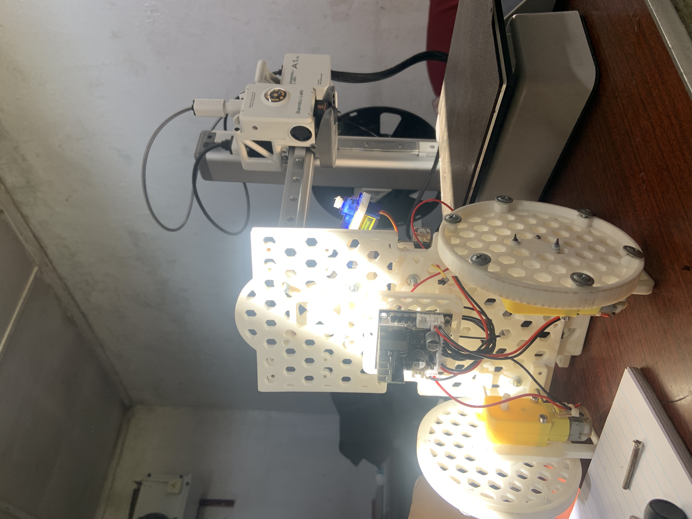

	
More photos

	

		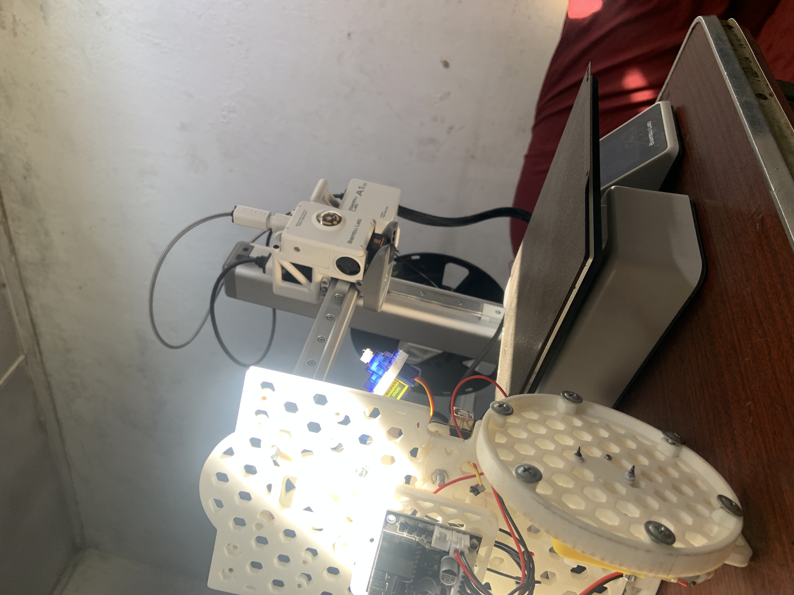
		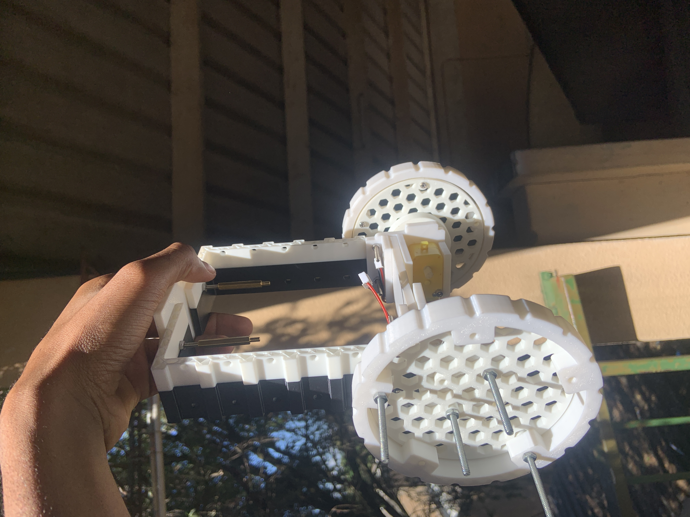
		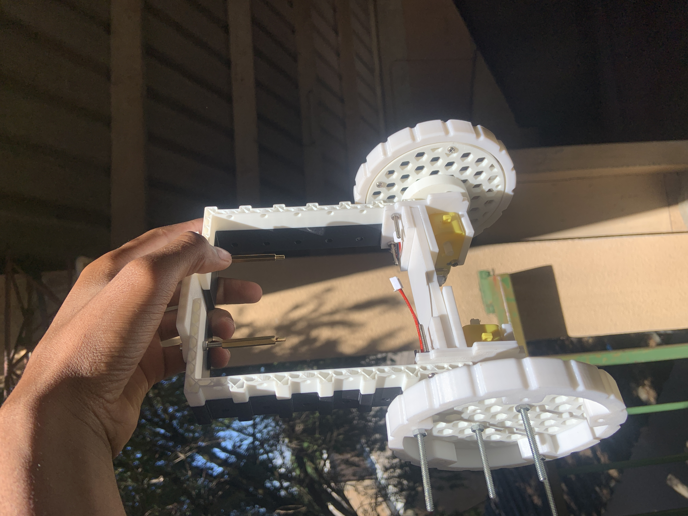
	

---

## The Reality Check 🧪

Here's where I get honest about my learning journey (and current challenges):

**What's Working ✅:**

The core platform is functional! I've successfully built working prototypes and validated the PCB design with real-world testing. The ESP32-based control system, motor drivers, and IMU sensor integration all perform as expected. The modularity of the design means the same platform has been used for multiple applications beyond self-balancing robots.

	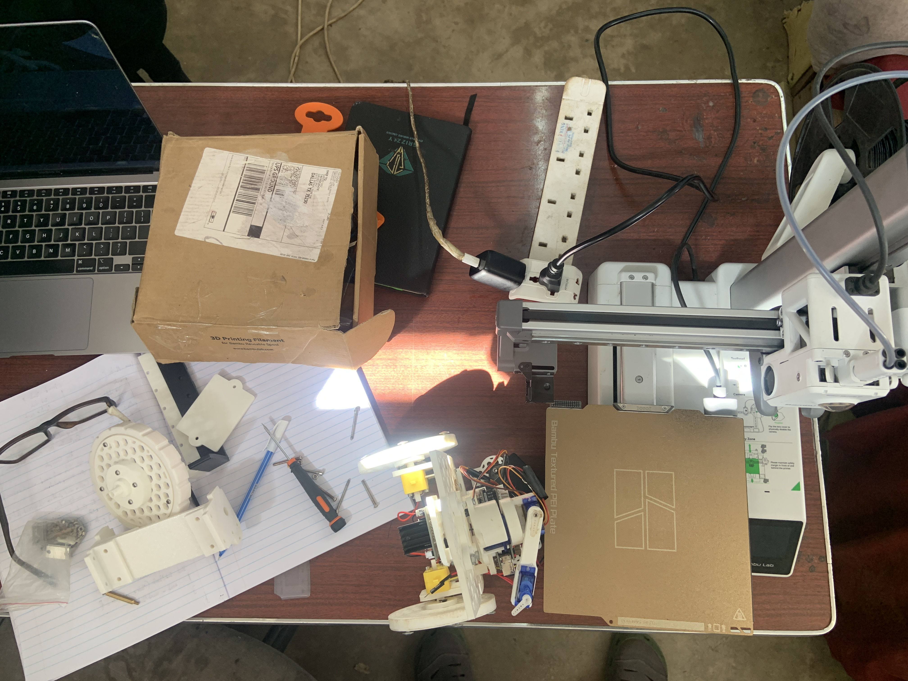
	 <em>Robot balancing in action</em>

**What's Not Working ⚠️:**
- Some mechanical designs need optimization for different applications (weight distribution, center of gravity)
- Sensor calibration requires careful tuning depending on the specific use case
- Documentation and example code could be more comprehensive for different robot designs

**What's Still in Development 🛠️:**
- Expanding example code and tutorials for different robotics applications
- Developing reference designs for various platforms (balancing robots, autonomous rovers, drone controllers)
- Creating comprehensive educational resources and lesson plans
- Building a community repository of user-contributed designs and modifications

	
	 <em>PCB and mechanical design concepts</em>

## My Learning Curve 📈

I should be upfront: I'm no expert in any of these technical branches. 3D modeling, PCB design, control systems, embedded programming - this project and others I've worked on have all been massive learning experiences. Every "failure" has taught me something valuable, but I've definitely hit the point where I could use guidance from people who've walked this path before.

This isn't about admitting defeat - it's about recognizing that complex projects benefit from community knowledge and collaboration. Some of my best learning has come from bouncing ideas off people who see things I miss or approach problems differently.

## How You Can Help 🤝

I'm looking for any kind of support, and it doesn't have to be a huge commitment:

**Technical Guidance 🛠️:**
- PCB design feedback, manufacturing best practices, and component selection
- Embedded systems and firmware optimization
- Mechanical design and 3D printing techniques
- Educational curriculum integration for robotics and embedded systems
- Code review for control algorithms and sensor fusion

**Knowledge Sharing 📚:**
- Pointing me toward useful resources, tutorials, or documentation
- Sharing your own project experiences and lessons learned
- Connecting me with others who might be interested in collaborating

**Brainstorming 🧠:**
- Manufacturing and scaling strategies
- Educational curriculum integration ideas
- Distribution and partnership opportunities

**Community Building 🌱:**
- Spreading the word about the project
- Connecting me with educational institutions or maker communities
- Sharing this with anyone who might be interested in African tech innovation

## The Bigger Picture 🌐

This isn't just about building robotics projects — it's about creating an open-source, locally relevant development platform that enables education and innovation across the continent. The vision includes:

- Open-source hardware and firmware that others can fork, modify, and improve
- Educational resources, tutorials, and reference designs for common applications
- Partnerships with schools, universities, and maker spaces for curriculum integration
- A pathway for local component sourcing and PCB fabrication across African regions
- Community-driven documentation and a repository of user projects and innovations

Every learning moment, every component test, every design iteration gets us closer to something that can genuinely impact how young people across Africa engage with technology and innovation.

## Electronics & Hardware Design

### Overview

To move the project beyond breadboards and jump-wires we designed a custom 2-layer PCB in KiCad. The board replaces fragile prototype wiring to improve reliability, reduce assembly time, and lower per-unit costs — all important for classroom and makerspace use.

### Key Subsystems

- **Processing & Control:** ESP32-WROOM module providing Wi‑Fi, Bluetooth, and Arduino-compatible development for students and makers.
- **Motion Sensing:** MPU‑6050 IMU (3‑axis gyroscope + 3‑axis accelerometer) used for balance sensing and closed‑loop control.
- **Motor Control:** Dual H‑bridge motor drivers with dedicated high‑current copper traces and thermal considerations for continuous operation.
- **Power Management:** LiPo battery support with a USB Type‑C charging input, onboard voltage regulators, and reverse‑polarity protection to protect classroom hardware.
- **Memory:** Onboard flash for firmware and simple data logging (sensor logs, calibration presets).
- **Connectivity & Expansion:** Standard I2C, SPI, and UART breakout headers plus modular connectors (J2, J3, J4) for motors and external sensors to keep the design flexible.

### Design Decisions

- Chosen parts prioritize local availability and low BOM complexity to make sourcing components easier in Zambia and nearby markets.
- A continuous ground plane and careful keep‑out were used around the ESP32 antenna to preserve wireless performance.
- Power traces for motors were routed and sized separately from logic power to reduce noise and avoid voltage drops during high current draw.
- Breakout headers and modular connectors were added to encourage experimentation and easy repairs in an educational setting.

### Toolchain

The PCB was designed in KiCad. 3D renders were generated from the PCB model to validate component placement and mechanical fit before fabrication.

### Status

The board is at Revision 1 and currently in fabrication and early testing. Feedback from these tests will guide revisions to the layout and BOM.

For full schematics, PCB layout files, and fabrication notes see the project hardware folder: [PCB-Design](PCB-Design).

### Board Renders

	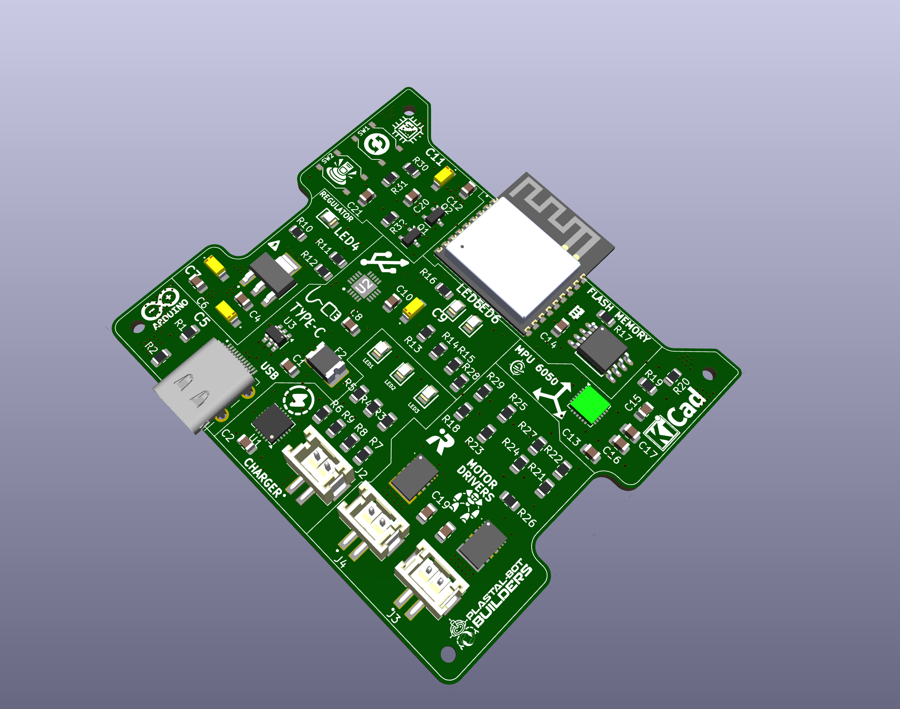
	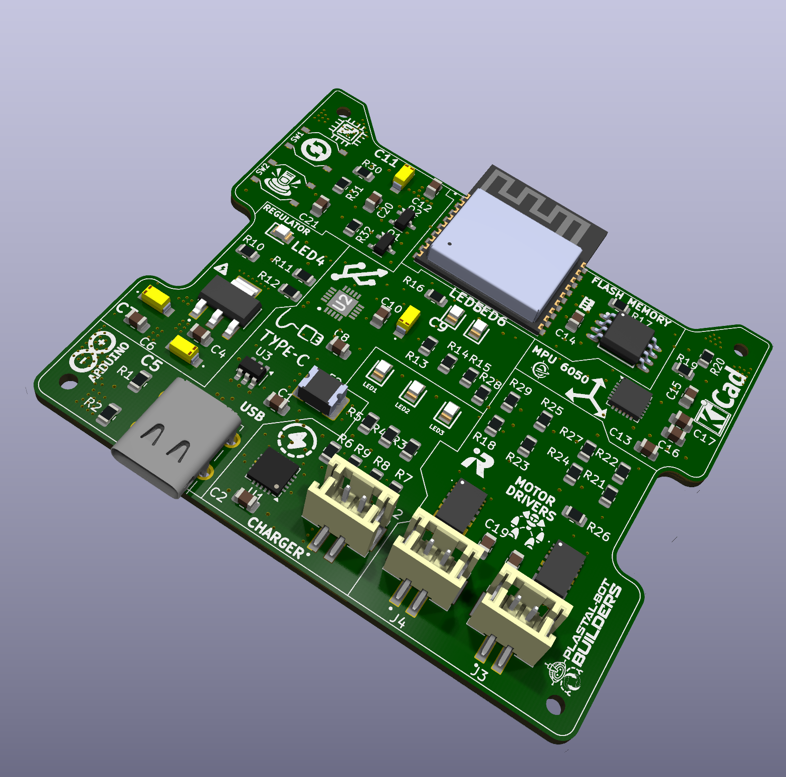

<em>Top and bottom 3D renders of the RoboCore PCB. Replace these placeholder files with the actual KiCad export renders in the `PCB-Design` folder.</em>

## Get Involved 📣

If any of this resonates with you - whether you're a technical expert, educator, maker, or just someone who believes in making technology more accessible - I'd love to connect.

You can reach me through:
- This platform (just send a message!)
- Website: [www.plastalbotbuilders.com](https://plastalbot.comon.tech/home)
- Email: fredrickmwepu22@gmail.com

Even if you can't directly contribute technical expertise, sharing this project, connecting me with others, or just offering encouragement makes a real difference.

## Final Thoughts 💡

Building RoboCore Zambia has been humbling, educational, and incredibly motivating. Every challenge reminds me why this work matters — because somewhere, a young person is waiting for the chance to learn, build, and innovate, and we have the opportunity to make that possible.

	<a href="GypulResources/Videos/IMG_8343.MOV">
		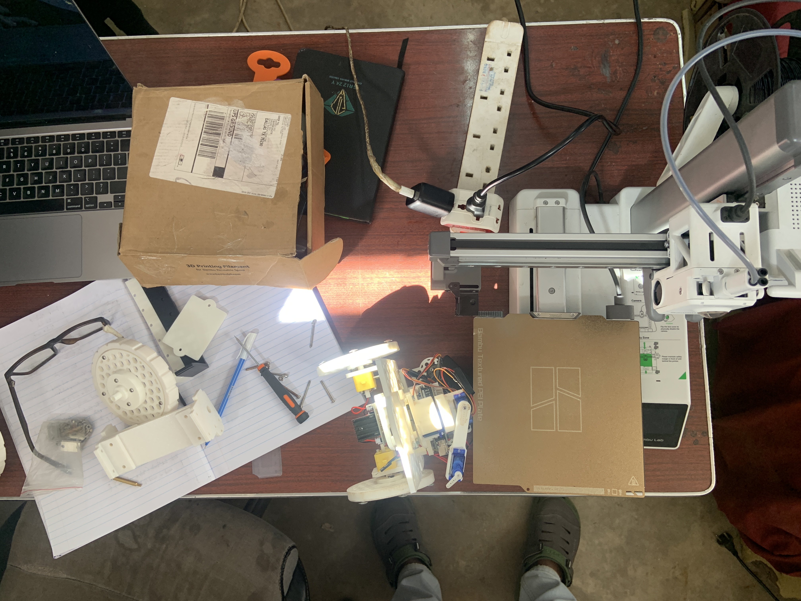
	</a>
	 <em>Click image to watch a short demo video</em>

Thanks for taking the time to read this, and thanks in advance for any way you choose to support this journey. Together, we can build an open-source robotics platform that empowers the next generation of African innovators, engineers, and educators.

---

*This project represents just one piece of the larger puzzle of making technology education accessible across Africa. Every contribution, no matter how small, helps build that future.*
